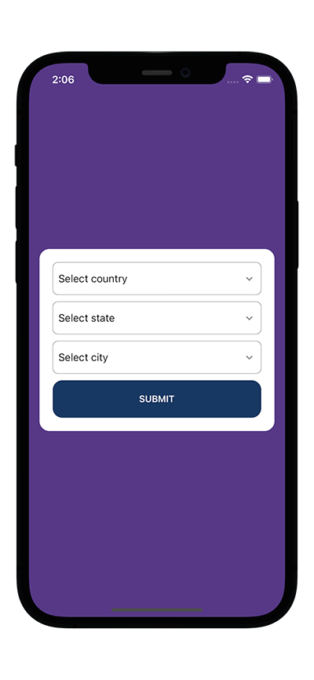

# Dependent Dropdown List in React Native

In this project I have created cascading dropdowns to display country, state and city list. Based on users selection of country list of state will apear and similarly based on country and state user will have list cities. 

This project is done with the help of API from https://countrystatecity.in/ and the select dropdown has been created with [react native element dropdown](https://github.com/hoaphantn7604/react-native-element-dropdown) package.

## Watch it on YouTube

This repository is part of of a tutorial on my YouTube channel.
- [Dependent Dropdown List in React Native](https://youtu.be/tN6MpJ9ElJY)

## Project Setup
- Install the packages by using `npm install` command
- In the root path of the directory you'll find `.env_example` file, change that to `.env` and use your own API key from the site mentioned above.

## App Screenshot
